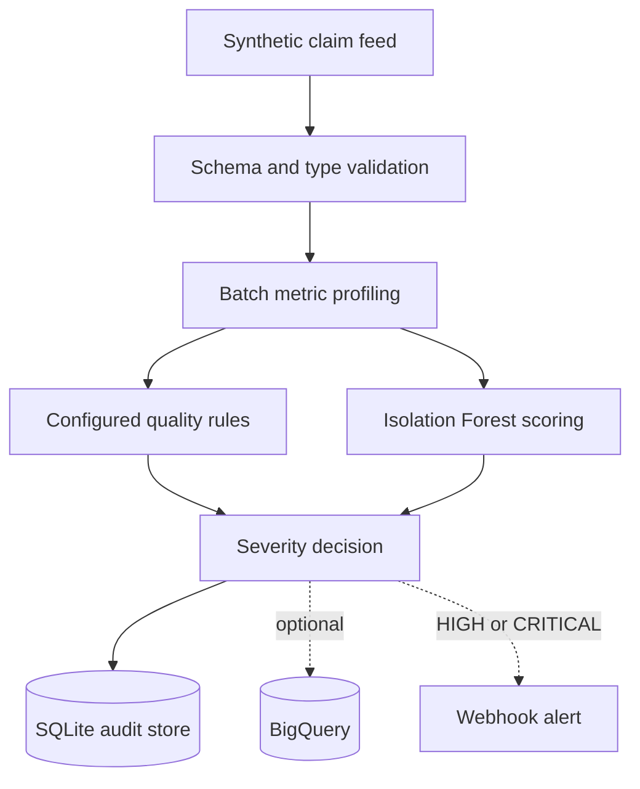

# AI-Powered Data Anomaly Detection Pipeline

[](https://github.com/SudamaPandit/ai-powered-data-anomaly-detection-pipeline/actions/workflows/ci.yml)
[](https://www.python.org/)

A production-oriented data observability pipeline that detects quality, volume, freshness, and distribution anomalies in synthetic healthcare claim feeds. It combines explainable rules with an Isolation Forest model, persists audit evidence, and supports optional BigQuery storage and webhook alerts.

This repository monitors the health of incoming data. It does not predict patient outcomes, and all sample records are synthetic.

## Problem being solved

A partner claim feed can arrive successfully and still be unusable. Common incidents include a sudden drop in row count, duplicate claim IDs, missing member identifiers, invalid statuses, negative amounts, late delivery, or a distribution shift caused by an upstream mapping defect.

Hard rules catch known violations. They are less effective when several metrics move in an unusual pattern without individually crossing a limit. This pipeline runs both rule-based and unsupervised detection so an operator receives an anomaly decision together with the evidence needed to investigate it.

## Architecture



See [architecture and failure behavior](docs/architecture.md) for the detailed flow.

## What is implemented

- Required-column validation and safe type normalization
- Batch profiling for volume, duplicates, nulls, invalid values, amount distribution, and freshness
- Eight configurable data-quality and service-level rules
- Reproducible Isolation Forest training and model persistence
- Deterministic rule/model severity policy
- Content-based batch IDs and idempotent audit writes
- Transactional SQLite store for local execution
- Optional BigQuery store using Application Default Credentials
- Optional Slack-compatible HTTPS webhook alerts
- JSON application logs with run, dataset, and batch context
- Synthetic claim generator with repeatable random seeds
- Unit, integration-style, CLI, storage, and alert tests
- Python 3.11/3.12 CI plus a container smoke test

## Current boundaries

- The pipeline runs locally and in Docker; it is not deployed to a live cloud environment.
- BigQuery behavior is unit-tested with a fake client, not against a provisioned GCP project.
- The included model is trained during setup; trained artifacts are intentionally excluded from Git.
- Thresholds demonstrate the design and must be calibrated against real incident history before production use.
- CSV is the implemented source format. Cloud Storage event handling is a future deployment concern.

## Metrics and controls

| Metric | Purpose |
|---|---|
| `row_count` | Detect missing or incomplete deliveries |
| `duplicate_rate` | Detect repeated business keys |
| `null_member_rate` | Monitor a required domain identifier |
| `invalid_amount_rate` | Detect null, non-numeric, or negative amounts |
| `invalid_status_rate` | Detect values outside the data contract |
| `invalid_timestamp_rate` | Detect unparseable ingestion timestamps |
| `mean_amount`, `p95_amount` | Detect distribution shifts |
| `freshness_hours` | Detect late-arriving feeds |

Thresholds, severities, feature order, contamination, and the minimum training history are maintained in [`config/claims.yml`](config/claims.yml).

## Quick start

Prerequisites: Python 3.11 or 3.12.

```bash
python -m venv .venv
source .venv/bin/activate
python -m pip install --upgrade pip
python -m pip install -e ".[dev]"
make check
make demo
```

`make demo` trains from 30 normal metric snapshots, analyzes the intentionally anomalous sample feed, and writes the audit result to `data/anomalies.db`. The demo uses a fixed `--as-of` timestamp so freshness is repeatable.

## Run each stage manually

Train the detector:

```bash
python -m anomaly_pipeline train \
  --history data/sample/historical_metrics.csv \
  --config config/claims.yml \
  --model artifacts/isolation_forest.joblib
```

Analyze a batch:

```bash
python -m anomaly_pipeline detect \
  --input data/sample/claims_current.csv \
  --history data/sample/historical_metrics.csv \
  --config config/claims.yml \
  --model artifacts/isolation_forest.joblib \
  --store data/anomalies.db \
  --as-of 2026-09-22T12:00:00Z
```

The command prints a JSON result containing the dataset, batch ID, metric values, model score, final severity, and each rule finding. The supplied batch is intentionally small and contains a duplicate ID, a blank member ID, a negative amount, an unknown status, an invalid timestamp, and an amount outlier.

## Generate another synthetic batch

```bash
python scripts/generate_synthetic_data.py --rows 1000 --seed 7 --output data/normal.csv
python scripts/generate_synthetic_data.py --rows 1000 --seed 7 --anomaly --output data/anomalous.csv
```

## Optional BigQuery sink

1. Install `python -m pip install -e ".[gcp]"`.
2. Replace `PROJECT_ID` in [`sql/bigquery/schema.sql`](sql/bigquery/schema.sql) and run the DDL.
3. Configure Application Default Credentials.
4. Export `GCP_PROJECT_ID` and, optionally, `BIGQUERY_DATASET`.
5. Add `--sink bigquery` to the detect command.

The application never stores a service-account key. Local and hosted execution should use standard Google authentication or workload identity.

## Optional alerts

Set `ANOMALY_SLACK_WEBHOOK_URL` outside source control and add `--alert`. Only HIGH and CRITICAL results are sent. The audit write occurs before notification so a temporary webhook failure does not lose the detection evidence.

## Repository structure

```text
.
├── config/                 Dataset contract, rules, and model settings
├── data/sample/            Synthetic input and normal historical metrics
├── docs/                   Architecture notes and design decisions
├── scripts/                Deterministic synthetic data generator
├── sql/bigquery/           Audit schema and operational summary query
├── src/anomaly_pipeline/
│   ├── detection/          Rules, model training/scoring, severity policy
│   ├── storage/            SQLite and optional BigQuery adapters
│   ├── alerts.py           Slack-compatible webhook notification
│   ├── pipeline.py         End-to-end orchestration and idempotency
│   ├── profiling.py        Dataset-level feature calculation
│   └── validation.py       Structural validation and type normalization
└── tests/                  Unit and integration-style tests
```

## Quality checks

```bash
make lint       # Ruff rules and formatting
make typecheck  # Strict mypy checks
make test       # Pytest with branch coverage; minimum 85%
make check      # All checks
```

GitHub Actions runs the checks on Python 3.11 and 3.12 and separately builds the Docker image. The workflow has read-only repository permissions, timeouts, dependency caching, and concurrency cancellation. Dependabot checks Python packages and GitHub Actions monthly.

## Design choices

- Bad rows are not silently dropped. They stay in the batch so their rates are observable.
- Known contract violations remain rule-driven and explainable.
- The model scores aggregate feed behavior rather than sensitive claim-level outcomes.
- Robust scaling reduces sensitivity to skewed metric distributions.
- File-content hashing makes retries idempotent even when a file is renamed.
- Storage adapters isolate cloud concerns from detection logic.
- The default path works without cloud credentials, which keeps tests deterministic.

The hybrid decision is recorded in [ADR 001](docs/decisions/001-hybrid-detection.md).

## Production improvements

Before operating this at enterprise scale, I would add a Cloud Storage event source, Cloud Run Job deployment, Secret Manager integration for the webhook, model/version metadata in BigQuery, a retraining approval workflow, false-positive feedback, live GCP integration tests, and dashboards with alert-rate and detection-latency SLOs.

## License

MIT
