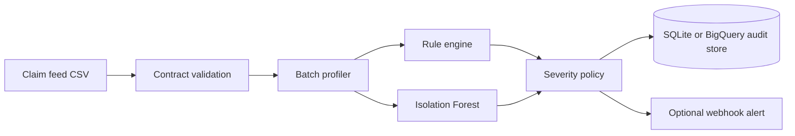

# Architecture and data flow

This project detects operational anomalies at the dataset-batch level. It deliberately does not score individual patients or predict medical outcomes. All included records are synthetic and contain no protected health information.

## Runtime flow

1. The input file is hashed. The first 16 SHA-256 characters become the batch ID.
2. Required columns are checked before processing. Values are normalized, but invalid records are retained so their rates can be measured.
3. The profiler reduces a batch to nine operational metrics.
4. Deterministic rules evaluate known data contracts and service-level expectations.
5. Isolation Forest evaluates whether the combined metric pattern resembles normal history.
6. A deterministic policy assigns the final severity. A model anomaly cannot suppress a rule failure.
7. The result and rule evidence are committed together. The dataset and batch ID form an idempotency key.
8. HIGH and CRITICAL results can be delivered to a Slack-compatible HTTPS webhook.

## Why dataset-level features

The pipeline models the health of a feed, not the business outcome of a claim. Dataset-level features are inexpensive to retain, do not require storing claim-level data in the model artifact, and map directly to operational questions:

- Did the expected number of records arrive?
- Did nulls or duplicates increase?
- Did a source start sending invalid statuses or amounts?
- Is the feed late?
- Did the amount distribution move unexpectedly?

## Detection strategy

Rules are the primary control for conditions that are always unacceptable. For example, a negative claim amount is not made acceptable by a model. The Isolation Forest complements rules by finding multivariate patterns, such as several metrics moving moderately at the same time without any one metric crossing its hard threshold.

The model uses `RobustScaler` because operational metrics can be skewed, followed by a 200-tree `IsolationForest`. The random seed, contamination rate, feature order, and minimum history size are configuration-controlled. Feature validation rejects null, non-numeric, and infinite training values.

## Storage choices

SQLite makes the repository runnable without cloud access and supports transactional, idempotent local testing. The BigQuery adapter uses Application Default Credentials and streaming inserts. Its SQL schema partitions run history by date and clusters by dataset and severity.

The BigQuery adapter is unit-tested with a fake client. A live GCP integration test is not included because this public repository has no project credentials or provisioned dataset.

## Failure behavior

- A missing input file fails before any audit write.
- Missing required columns or an empty batch fail validation.
- Invalid field values remain in the batch and contribute to anomaly metrics.
- A missing/incompatible model artifact fails before scoring.
- Database writes are atomic for SQLite.
- A failed webhook does not occur until after the audit result has been stored.
- BigQuery row errors are surfaced instead of being silently ignored.

## Production deployment pattern

A production deployment could place files in Cloud Storage, invoke this container through Cloud Run Jobs, store results in BigQuery, and schedule it with Cloud Scheduler or Workflows. Those cloud resources are not created by this repository. Keeping deployment separate avoids claiming an environment that has not been provisioned or integration-tested.

